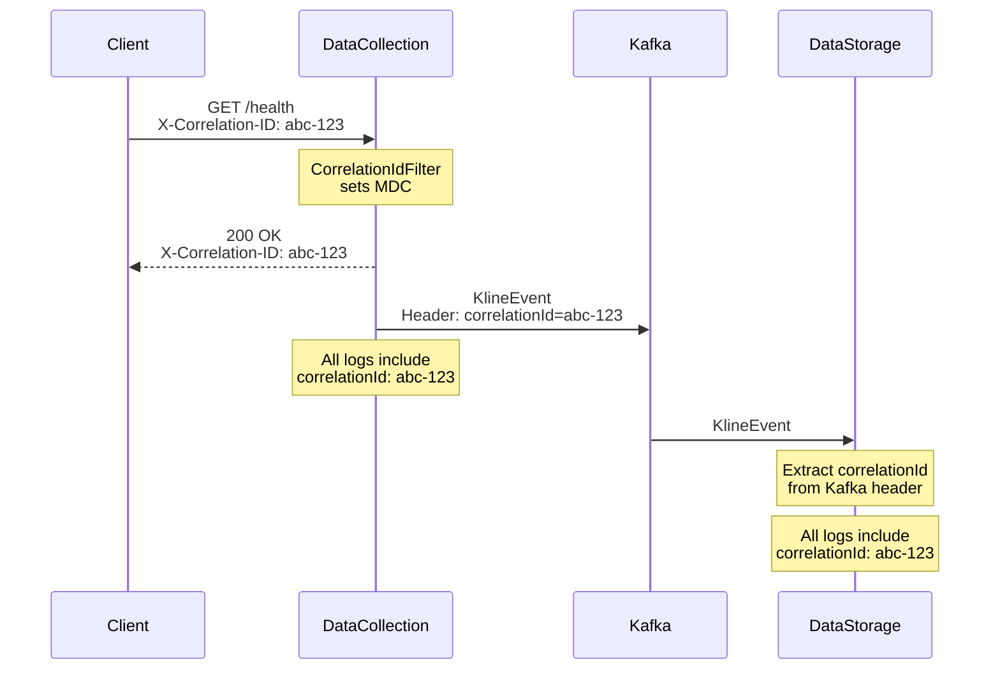

# Logging Strategy Guide

## Overview

This guide covers the comprehensive logging infrastructure implemented across all Binance AI Traders services, including correlation IDs for distributed tracing, structured JSON logging, and environment-specific configurations.

## Table of Contents

1. [Architecture](#architecture)
2. [Correlation IDs](#correlation-ids)
3. [Log Levels](#log-levels)
4. [Structured Logging](#structured-logging)
5. [Environment Configuration](#environment-configuration)
6. [Best Practices](#best-practices)
7. [Troubleshooting](#troubleshooting)
8. [Examples](#examples)

---

## Architecture

### Components

- **Java Services** (4):
  - binance-data-collection
  - binance-data-storage
  - binance-trader-macd
  - binance-trader-grid

- **Python Services** (1):
  - telegram-frontend-python

### Logging Stack

- **Java**: Logback + Logstash Encoder + SLF4J
- **Python**: python-json-logger + contextvars
- **Format**: JSON (testnet/prod) or Plain Text (dev)
- **Storage**: File rotation (30 days) + Console output

---

## Correlation IDs

### What Are Correlation IDs?

Correlation IDs are unique identifiers that track requests across multiple services, enabling distributed tracing and debugging.

### How They Work

1. **HTTP Requests**:
   - Client sends request with `X-Correlation-ID` header (optional)
   - Service extracts ID or generates a new UUID
   - Service returns ID in response header
   - ID is added to MDC/contextvars for all log statements

2. **Kafka Messages**:
   - Producer adds `correlationId` to Kafka headers
   - Consumer extracts ID and sets in MDC/contextvars
   - All downstream operations inherit the ID

### Implementation

#### Java Services

```java
import com.oyakov.binance_shared_model.logging.LoggingUtils;
import lombok.extern.log4j.Log4j2;

@Log4j2
public class MyService {
    public void processRequest() {
        // Correlation ID is automatically in MDC from filter
        log.info("Processing request"); // Automatically includes correlationId
        
        // Get current correlation ID
        String correlationId = LoggingUtils.getCorrelationId();
        
        // Pass to downstream services via REST/Kafka headers
    }
}
```

#### Python Services

```python
from oam.correlation import get_correlation_id, set_correlation_id

def my_function():
    # Get current correlation ID
    correlation_id = get_correlation_id()
    logger.info("Processing request")  # Automatically includes correlation_id
```

---

## Log Levels

### Guidelines

| Level | When to Use | Examples |
|-------|-------------|----------|
| **TRACE** | Extremely detailed debugging | Variable values, loop iterations |
| **DEBUG** | Development debugging | Method entry/exit, intermediate results |
| **INFO** | Normal operations | Service started, configuration loaded, request processed |
| **WARN** | Unexpected but handled | Retry attempts, deprecated API usage, missing optional config |
| **ERROR** | Errors requiring attention | Failed operations, exceptions, data integrity issues |

### Environment-Specific Levels

| Environment | Root | Application (com.oyakov) | Spring | Kafka |
|-------------|------|--------------------------|--------|-------|
| **dev** | DEBUG | TRACE | INFO | WARN |
| **testnet** | INFO | DEBUG | INFO | WARN |
| **mainnet** | INFO | INFO | WARN | ERROR |

---

## Structured Logging

### Java - Using LoggingUtils

```java
import com.oyakov.binance_shared_model.logging.LoggingUtils;
import java.util.Map;

// Error with context
Map<String, Object> context = LoggingUtils.createTradingContext("BTCUSDT", "5m");
context.put("quantity", order.getQuantity());
LoggingUtils.logError(log, "Failed to place order", exception, context);

// Business error (no exception)
Map<String, Object> context = LoggingUtils.createOrderContext("BTCUSDT", orderId, "LIMIT");
LoggingUtils.logBusinessError(log, "Insufficient balance", context);

// External API error
LoggingUtils.logExternalApiError(log, "Binance API", 429, responseBody);
```

### Python - JSON Logging

```python
import logging
from oam.correlation import get_correlation_id

logger = logging.getLogger(__name__)

# Standard logging (correlation_id added automatically)
logger.info("Processing kline event", extra={
    "symbol": "BTCUSDT",
    "interval": "5m",
    "price": 50000.0
})

# Error logging with context
try:
    process_order()
except Exception as e:
    logger.error("Order processing failed", exc_info=True, extra={
        "symbol": symbol,
        "order_id": order_id,
        "correlation_id": get_correlation_id()
    })
```

---

## Environment Configuration

### Java Services

#### application-testnet.yml

```yaml
logging:
  level:
    root: INFO
    com.oyakov: DEBUG
    org.springframework: INFO
    org.apache.kafka: WARN
  file:
    name: /var/log/${spring.application.name}/application.log
    max-history: 30
  pattern:
    console: "%d{yyyy-MM-dd HH:mm:ss.SSS} [%thread] %-5level %logger{36} [%X{correlationId:-NO-CORR-ID}] - %msg%n"
```

### Python Services

#### Environment Variables

```bash
LOGGING_PROFILE=json
PYTHON_LOGGING_CONFIG=/app/logs/config/logging-json.ini
```

### Docker Compose

```yaml
services:
  binance-data-storage-testnet:
    environment:
      - SPRING_PROFILES_ACTIVE=testnet
      - LOGGING_PROFILE=json
    volumes:
      - ./logs/binance-data-storage:/var/log/binance-data-storage
```

---

## Best Practices

### DO

✅ **Always use correlation IDs**: They're automatically added - no extra work needed  
✅ **Log at appropriate levels**: Use DEBUG for development, INFO for operations  
✅ **Include context**: Use `LoggingUtils` helper methods to add structured context  
✅ **Log external API calls**: Track latency and failures  
✅ **Log state changes**: Track order status changes, position updates  
✅ **Use structured data**: Add extra fields as key-value pairs  

### DON'T

❌ **Don't log sensitive data**: API keys, passwords, PII  
❌ **Don't log in tight loops**: Use DEBUG level or aggregate metrics  
❌ **Don't log full stack traces for expected errors**: Use structured error logging  
❌ **Don't use string concatenation**: Use parameterized logging  
❌ **Don't log without context**: Always include relevant business data  

---

## Troubleshooting

### Finding Logs by Correlation ID

#### Docker Logs

```powershell
# Search all services for a correlation ID
docker logs binance-data-storage-testnet 2>&1 | Select-String "abc-123-def"

# Follow logs with correlation ID filtering
docker logs -f binance-data-collection-testnet 2>&1 | Select-String "abc-123-def"
```

#### JSON Log Files

```powershell
# Parse JSON logs and filter by correlation ID
Get-Content ./logs/application.json | 
    ConvertFrom-Json | 
    Where-Object { $_.correlationId -eq "abc-123-def" } |
    Format-Table timestamp, level, message
```

### Common Issues

#### Correlation ID Not Appearing

**Problem**: Logs don't show correlation IDs  
**Solution**:
1. Verify `CorrelationIdFilter` is registered (Java) or middleware is added (Python)
2. Check that MDC context is not cleared prematurely
3. Ensure Kafka consumers extract correlation ID from headers

#### Logs Not in JSON Format

**Problem**: Logs are plain text instead of JSON  
**Solution**:
1. Verify `SPRING_PROFILES_ACTIVE=testnet` (Java)
2. Check `LOGGING_PROFILE=json` (Python)
3. Ensure logback-spring.xml uses correct profile
4. Verify logstash-logback-encoder dependency is present

#### Missing Context in Errors

**Problem**: Error logs lack business context  
**Solution**:
1. Use `LoggingUtils.logError()` instead of `log.error()`
2. Pass context maps with relevant data
3. Ensure exceptions are properly propagated

---

## Examples

### Complete Request Flow



### Sample JSON Log Entry

```json
{
  "timestamp": "2025-01-18T15:30:45.123Z",
  "level": "INFO",
  "thread": "http-nio-8081-exec-5",
  "logger": "com.oyakov.binance_data_storage.service.KlineDataService",
  "message": "Saved kline event to PostgreSQL",
  "correlationId": "abc-123-def-456",
  "service": "binance-data-storage",
  "symbol": "BTCUSDT",
  "interval": "5m",
  "timestamp_ms": 1705590645123
}
```

### Testing Correlation ID Propagation

```powershell
# Run the test script
.\scripts\logging\test-correlation-ids.ps1

# Analyze logs
.\scripts\logging\analyze-logs.ps1 -LastMinutes 30 -ShowOrphans
```

---

## Query Examples

### Grafana Loki Queries

```logql
# All logs for a specific correlation ID
{service="binance-data-storage"} | json | correlationId="abc-123-def"

# Error logs with correlation IDs
{service=~"binance-.*"} | json | level="ERROR" | correlationId!=""

# Count logs by correlation ID
sum by (correlationId) (count_over_time({service="binance-data-storage"}[5m]))
```

### Elasticsearch Queries

```json
{
  "query": {
    "match": {
      "correlationId": "abc-123-def"
    }
  },
  "sort": [
    { "timestamp": "asc" }
  ]
}
```

---

## Summary

This logging infrastructure provides:

- ✅ **Distributed Tracing**: Track requests across all services
- ✅ **Structured Logging**: Easy to parse and query
- ✅ **Environment Flexibility**: Different configs for dev/test/prod
- ✅ **Troubleshooting**: Quickly find related logs across services
- ✅ **Production Ready**: JSON format, log rotation, performance optimized

For questions or issues, refer to:
- Service documentation: `binance-ai-traders/services/{service-name}.md`
- Infrastructure guide: `binance-ai-traders/infrastructure/quick-reference.md`
- Memory entries: `binance-ai-traders/memory/memory-index.md`

